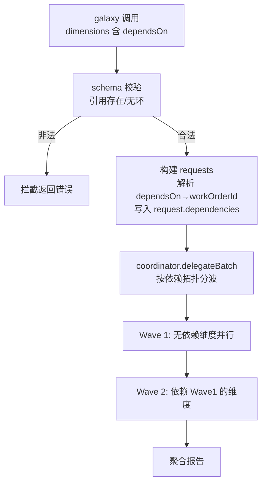

> **Model: deepseek-v4-flash (cheap)**
> **Status: REJECTED**（用户 2026-07-31 否决——Ultra Workflow 的 team 阶段已覆盖依赖波次能力，不重复建设）

# galaxy 维度依赖波次（dependsOn）实现计划

## 需求提炼

用户原话：「galaxy下一步如何要超过team和council如何制定」——我提出路线 A（能力内嵌），经确认本计划只做**第一步：维度依赖波次**。

**目标**：galaxy 的 dimensions 支持 `dependsOn: string[]`（引用其他维度名），有依赖的维度按拓扑分波执行——无依赖的维度同波并行，依赖者等被依赖维度完成后才派发。把 team 的 wave-gate 能力内嵌进 galaxy。

**非目标**（本计划不做，后续步骤）：
- reviewPlan 评审门禁（council 裁决内嵌）——第二步
- 裁决聚合升级（review 否决票 + 可审计输出）——第三步
- 维度上限放宽（maxDimensions 可配置）——独立事项，另行处理

## 现状与证据

- `dimensionSchema`（src/tools/galaxy.ts:64）无依赖字段；维度全部同时构建 requests，仅显式 review 维度与 autoReview 有 `dependencies`（galaxy.ts:514-531）
- coordinator 已完整支持依赖传播：`DelegationRequest.dependencies?: string[]`（src/agent/coordinator.ts:188）→ `WorkOrder.dependencies`（1338/1355/2497/2517），work-order 队列按依赖排序
- `galaxyWorkerParentTurnId`（galaxy.ts）生成确定性 `batch:<toolUseId>-galaxy-<dim>:<authority>` ID，`workerOrderId()` 转稳定 work-order ID——依赖边直接用这些 ID

**结论**：coordinator 层不需要改，全部改动在 galaxy.ts 的 schema + requests 构建 + 校验，加 galaxy.test.ts 用例。

## 设计

### 数据流图



### 改动点

1. **schema**（galaxy.ts:64 dimensionSchema）：加 `dependsOn: z.array(z.string()).min(1).optional()`，description 注明引用维度名、被依赖维度必须存在于本批 dimensions。
2. **校验**（pre-flight 阶段，dimensions 循环内）：
   - 引用不存在的维度名 → 拦截：`维度「X」dependsOn 引用了不存在的维度「Y」`
   - 自依赖 / 循环依赖 → 拦截（用拓扑检测，DFS 环检测）
3. **requests 构建**（execute Phase 2）：解析每个维度的 dependsOn → 目标维度的全部 `workerOrderId(parentTurnId)`（含该维度所有 authority/replica 的 ID）→ 设 `request.dependencies`。与被依赖维度同一波无依赖，天然满足"先等后干"。
4. **DP 维度互斥**：`parallelism=data` 维度若 dependsOn 其他维度，允许（等先行者）；被依赖维度为 DP 时，依赖者等它全部 replica 完成（所有 replica ID 进 dependencies）——coordinator 已支持多依赖。

### 测试（galaxy.test.ts 追加，RED→GREEN）

- 用例 1：dimension B `dependsOn: ['a']` → requests 中 B 的 dependencies 包含 A 的 workOrderId
- 用例 2：dependsOn 引用不存在维度 → execute 返回 isError 且提示缺失维度名
- 用例 3：循环依赖（a→b, b→a）→ 拦截 isError
- 用例 4：DP 维度被依赖 → 依赖者 dependencies 含全部 replica ID
- 用例 5：无 dependsOn 时行为不变（现有测试全绿即回归）

## 反证/复现

- **反证测试**：没有用例 1，错误实现（dependsOn 被忽略）会通过现有测试——故用例 1 必须断言 `dependencies` 数组内容，不只看调用成功。
- **复现方式**：写用例 1 先 RED（当前实现 dependencies 为空），再实现 schema+构建逻辑转 GREEN。
- **回归**：现有 galaxy.test.ts 22 用例必须保持全绿——dependsOn 是纯增量字段，缺省时行为不变。

## 验证命令

```bash
npx tsc --noEmit                                          # typecheck 硬门禁
npx tsx --test src/tools/__tests__/galaxy.test.ts         # galaxy 全量（22 旧 + 5 新 = 27）
```

## 锚点（当前工作树）

- galaxy.ts:64 `dimensionSchema = z.object({` — 加 dependsOn 字段
- galaxy.ts:86 `.refine(` — dimension 级 refine 链（可加互斥校验）
- galaxy.ts:514-531 — dependencies 先例（explicitReview/autoReview），新逻辑复用同模式
- coordinator.ts:188 — DelegationRequest.dependencies 类型（无需改）
- galaxy.test.ts — 追加 5 用例

## 风险

- description 篇幅：dimensionSchema 的 dependsOn 字段描述保持一行，不加长工具 description（上轮已瘦身）
- 循环依赖检测成本：维度 ≤5，DFS 开销可忽略
