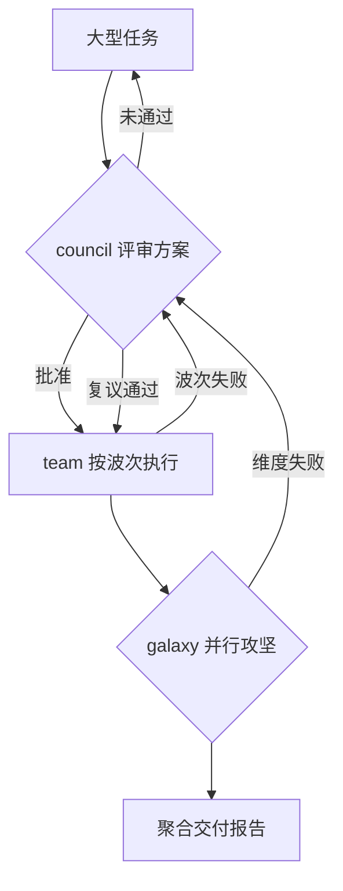

> **Model: deepseek-v4-flash (cheap)**
> **Status: APPROVED**（用户 2026-07-31 批准，仅批准本计划）

# Ultra Workflow —— council + team + galaxy 三合一全链路编排

## 需求提炼

用户原话：「做一个 ultra workflow 吧，把这三个结合起来」——把三个多 agent 编排机制合成一条超工作流：
- **council**（多席审查）：方案评审、反驳/辩论轮、确定性裁决
- **team**（波次执行）：按计划分波派发、依赖排序、wave-gate
- **galaxy**（星河集群）：维度并行攻坚、多星域专家、聚合审查

**目标**：一个可激活的工作流协议（内置 skill `ultra-workflow`），让 agent 面对大型任务时自动编排为「**council 评审方案 → team 按波落地 → galaxy 并行攻坚/审查**」三阶段，实现"先审再干、按波落地、并行攻坚"。

**非目标**：
- 不新增编排工具——复用 `council_convene` / `team_orchestrate` / `galaxy` 三个既有工具（零核心代码风险）
- 不改三个底层工具的代码
- 不含 dependsOn 波次增强（那是已提交的另一计划，正交）

## 数据流图

## 三阶段协议（skill body 内容）

1. **评审阶段（council）**：调用 `council_convene` 召集多席星域评审任务方案。未通过 → 按裁决意见修订后复议；通过 → 拿可审计的批准计划进入执行。
2. **执行阶段（team）**：把批准计划转 `planJson`/Markdown 交给 `team_orchestrate` 分波执行（分片端到端、wave-gate）。任一波失败 → 回 council 复议或缩小范围。
3. **攻坚/审查阶段（galaxy）**：执行中的独立子问题、跨维度一致性、结果验证 → `galaxy` 拆维度并行；或对产物做多星域只读审查（review 维度）。
4. **收尾**：聚合三阶段产物，输出交付报告（做了什么/遗留/偏差）。

**激活信号**：`/ultra-workflow`、`/ultra`、超工作流、全链路编排、"把三个结合"、大型任务多阶段（评审+执行+并行）。

## 落地改动

| 文件 | 改动 | 行号锚点 |
|---|---|---|
| `src/skills/skill-loader.ts` | BUILTIN_SKILLS 数组末尾追加 `ultra-workflow` skill 条目（name/description/triggers/body） | 数组起于 :390，galaxy 条目 :479 后追加 |
| `src/skills/__tests__/skill-loader.test.ts` | 补测试：registerBuiltinSkills 后 ultra-workflow 可发现（get('ultra-workflow') 存在）+ 触发词匹配（match('/ultra-workflow') 命中） | 测试文件沿用现有模式 |

内置 skill 不复制 `.rivet/skills/` 文件——避免重蹈 galaxy.md 同名覆盖矛盾的覆辙（已修，见 commit bbd3feb）。

## 验证

- `npx tsc --noEmit` exit 0
- `npx tsx --test src/skills/__tests__/skill-loader.test.ts` 全绿（含新用例）
- `npx tsx --test src/tools/__tests__/galaxy.test.ts` 全绿（回归确认不动 galaxy）

## 反证（瑶光）

- **RED 用例**：若 ultra-workflow skill 未注册，`skillRegistry.get('ultra-workflow')` 返回 undefined——先写断言再实现（RED→GREEN）
- **触发词**：`/ultra`、`超工作流` 必须命中 match()——否则 skill 不会被发现，协议形同虚设
- **回归面**：BUILTIN_SKILLS 追加不改变既有三个内置 skill 行为——现有 15 个 skill-loader 测试作回归基线
- **不做的事**：不验证三工具内部（已有各自测试）；不 mock 中间层——本协议是编排指引，验证点是 skill 层可发现性，不是工具执行链

## 验收面

用户动作：在会话中输入 `/ultra-workflow <大型任务>` 或描述「超工作流/把三个结合」→ 可观察结果：skill 被加载（`<invoked-skills>` 块出现 ultra-workflow 指令），agent 按「评审→执行→并行攻坚」三阶段编排，第一阶段为 council 方案评审而非直接执行。
